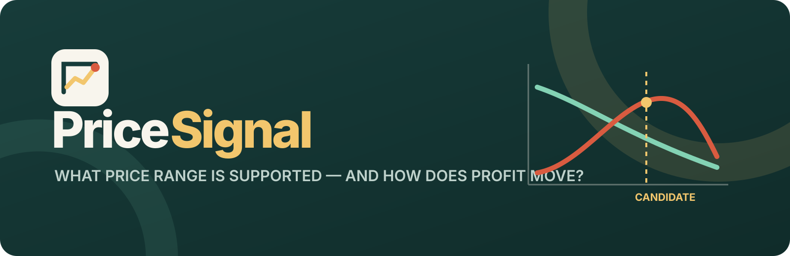

<p align="center">
  
</p>

<p align="center">
  
  
  
  <a href="LICENSE"></a>
</p>

<p align="center"><strong>Open pricing evidence — bound the price range, preserve uncertainty, and keep the evidence tier beside the economics.</strong></p>

> **Working-name status — local/private only:** an exact active **PriceSignal** product operates in competitor-price tracking, the same commercial neighborhood as this tool. This build is not cleared for public release and must be renamed before it is published, hosted, packaged, or promoted. See the dated [name screen](docs/name-screen.md).

**PriceSignal** helps analysts, product teams, and marketers compare a declared candidate price with a reference price. It accepts one of three evidence routes—an assigned-price experiment, a historical price–quantity series, or respondent-level willingness to pay—and keeps their interpretations separate. Every route feeds the same transparent economic layer: projected volume multiplied by declared unit margin.

Everything runs locally with open-source Python packages. There is no account, telemetry, external AI call, remote database, or built-in persistence.

## Read this first

> **PriceSignal bounds a pricing scenario; it does not turn a model into market truth.** Historical coefficients can be confounded, randomized tests support their tested prices and implementation, and WTP is not realized demand. Unit cost, addressable demand, competition, capacity, fairness, and execution still require accountable human judgment.

PriceSignal does not select a price because a p-value crossed a threshold. Before analysis, the contract records a reference price, candidate price, unit cost, planning scale, and a minimum worthwhile incremental contribution that must be above zero — with a zero threshold, the reading would collapse into a bare significance statement, which PriceSignal refuses to present as a decision. The resulting interval is compared with that business threshold.

## Supported evidence routes

### Randomized assigned-price test

Use one row per assigned unit with a positive assigned price and a non-negative purchase or quantity outcome. PriceSignal summarizes each arm, fits a power curve to arm means, and uses a stratified within-arm bootstrap for uncertainty. Binary purchase outcomes are supported.

A causal reading still requires a valid assignment process, assignment before outcome, acceptable outcome observation, faithful price delivery, limited interference, and a population matching the intended decision. The smooth curve between assigned prices is a functional-form assumption.

### Historical price–quantity series

Use one row per period with positive price and quantity plus optional numeric controls. PriceSignal fits a log–log model and reports the price coefficient as a constant-elasticity association. Newey–West HAC or HC3 covariance is available; a smearing factor retransforms log predictions.

Neither robust covariance estimator solves endogenous pricing, omitted promotions, seasonality, competitor action, stock-outs, distribution changes, or simultaneous demand shocks. This route is always labeled **ASSOCIATION ONLY**.

### Respondent-level willingness to pay

Use one row per respondent with a positive maximum WTP. At each price, PriceSignal calculates the empirical share with WTP at or above that price and bootstraps respondents.

Stated WTP is labeled **STATED VALUATION**. An appropriately implemented BDM or auction protocol may be labeled **INCENTIVE-COMPATIBLE VALUATION**, but even that is not a complete market-demand estimate.

## Try it in three minutes

1. Start the app and click **Load randomized price test**.
2. Review the saved contract: four assigned prices, a reference price, candidate price, unit cost, market opportunities, and a minimum worthwhile contribution.
3. Open **Data & support audit** and run the pricing analysis.
4. Inspect arm support, elasticity, the bounded volume and contribution curves, and all warnings.
5. Open **Decision & export** to compare the declared prices and download the privacy-minimized evidence pack.

All bundled records, products, prices, respondents, and outcomes are fictional and deterministic.

## Data layouts

Randomized price test:

| customer_id | assigned_price | purchased |
|---|---:|---:|
| C0001 | 29.00 | 1 |
| C0002 | 34.00 | 0 |

Historical series:

| period | price | quantity | promotion | distribution |
|---|---:|---:|---:|---:|
| 2025-W01 | 29.40 | 1421 | 1 | 0.73 |
| 2025-W02 | 34.10 | 1128 | 0 | 0.74 |

Valuation sample:

| respondent_id | wtp | segment |
|---|---:|---|
| R0001 | 31.50 | Practical |
| R0002 | 44.00 | Enthusiast |

See the [data guide](docs/data-guide.md) for units, support, missing values, and study-design expectations.

## Decision statuses

- **MEANINGFUL UPSIDE:** the full interval clears the declared minimum worthwhile contribution.
- **SUPPORTED UPSIDE:** the full interval is positive but does not clear that threshold.
- **UNCERTAIN UPSIDE:** the point estimate is positive but the interval includes no improvement.
- **NO CLEAR ADVANTAGE:** the interval includes both improvement and harm.
- **NO EVIDENCE OF UPSIDE:** the candidate does not improve expected contribution in this model.
- **POTENTIAL HARM:** the full interval is below zero.
- **OUTSIDE EVIDENCE RANGE:** the candidate or reference price requires extrapolation.

These statuses describe one declared comparison under one evidence model. They are not automatic pricing approvals.

## What the evidence pack contains

JSON, XLSX, and CSV-ZIP exports include:

- source filename, sheet, and SHA-256 fingerprint;
- evidence tier and decision contract;
- support audit, warnings, diagnostics, and method settings;
- aggregate price-arm or WTP summaries;
- coefficient or valuation summaries;
- the bounded price scenario table;
- candidate-versus-reference economics and interval;
- a compact `signal.price-evidence.v1` bridge for a future GateSignal import.

Uploaded row-level records, identifiers, outcomes, fitted values, residuals, and free text are excluded.

## Run locally

You need Python 3.10 or newer and a local copy of this folder.

**macOS:** double-click `run_app.command`.

**Windows:** double-click `run_app.bat`.

Or use a terminal:

```bash
python3 -m venv .venv
source .venv/bin/activate  # Windows: .venv\Scripts\activate
python -m pip install -r requirements.txt
python -m streamlit run app.py
```

The macOS launcher prefers local port `8588` and falls back to a free port between 8501 and 8599; it accepts the `PRICESIGNAL_PORT`, `PRICESIGNAL_MAX_UPLOAD_MB`, and `PRICESIGNAL_NO_BROWSER` environment variables. The Windows launcher always uses port `8588`. Setting `PRICESIGNAL_DEBUG=1` shows technical error details inside the app on any platform.

### Docker

```bash
docker build -t pricesignal .
docker run --rm -p 8588:8588 pricesignal
```

## No install? Give this file to an AI

[AI_ANALYST.md](AI_ANALYST.md) is a standalone analysis protocol for a capable AI assistant. It carries the same evidence-tier separation, calculations, warnings, and output structure. A local app remains the more private option.

## Development checks

```bash
python -m pip install -e ".[test]"
python -m pytest
python -m ruff check .
python -m build
```

Fixtures cover known elasticity recovery, randomized arm behavior, empirical WTP demand, decision boundaries, deterministic examples, safe imports and exports, and every Streamlit page.

## Relationship to the Signal suite

- **[WorthSignal](https://github.com/UlrikErlingsen/customer-value-analytics)** supplies customer and contribution economics that can improve pricing scenarios.
- **[SegmentSignal](https://github.com/UlrikErlingsen/customer-segmentation)** can reveal stable groups for separately designed pricing studies; PriceSignal does not search for exploitable personal prices.
- **[ChoiceSignal](https://github.com/UlrikErlingsen/conjoint-analysis)** estimates attribute utilities. WTP conversion remains outside its first release; PriceSignal accepts direct valuation or price-response evidence instead of silently converting weak price coefficients.
- **[ExperimentSignal](https://github.com/UlrikErlingsen/experiment-analysis)** is the general randomized-experiment engine. PriceSignal adds pricing-specific demand and contribution logic while retaining strict randomization caveats.
- **[AllocSignal](https://github.com/UlrikErlingsen/marketing-mix-allocation)** allocates marketing budgets, not product prices.
- **[GateSignal](https://github.com/UlrikErlingsen/launch-decision-gate)** can consume the aggregate PriceSignal bridge as one bounded launch input.

The maintained public suite is listed at [ulrikerlingsen.com](https://ulrikerlingsen.com). This working build is deliberately excluded until it has a cleared replacement name.

## Method references

- Becker, G. M., DeGroot, M. H., & Marschak, J. (1964). Measuring utility by a single-response sequential method. *Behavioral Science, 9*, 226–232. https://doi.org/10.1002/bs.3830090304
- Vickrey, W. (1961). Counterspeculation, auctions, and competitive sealed tenders. *Journal of Finance, 16*, 8–37.
- Newey, W. K., & West, K. D. (1987). A simple, positive semi-definite, heteroskedasticity and autocorrelation consistent covariance matrix. *Econometrica, 55*, 703–708. https://doi.org/10.2307/1913610
- MacKinnon, J. G., & White, H. (1985). Some heteroskedasticity-consistent covariance matrix estimators with improved finite sample properties. *Journal of Econometrics, 29*, 305–325. https://doi.org/10.1016/0304-4076(85)90158-7
- Efron, B. (1979). Bootstrap methods: Another look at the jackknife. *Annals of Statistics, 7*, 1–26. https://doi.org/10.1214/aos/1176344552
- Duan, N. (1983). Smearing estimate: A nonparametric retransformation method. *Journal of the American Statistical Association, 78*, 605–610. https://doi.org/10.1080/01621459.1983.10478017
- Schmidt, J., & Bijmolt, T. H. A. (2020). Accurately measuring willingness to pay for consumer goods. *Journal of the Academy of Marketing Science, 48*, 499–518. https://doi.org/10.1007/s11747-019-00666-6

## Originality and license

PriceSignal is an independent implementation based on public pricing, experimental, econometric, and valuation literature. It does not reproduce lecture slides, classroom cases, assessment material, teaching diagrams, proprietary pricing templates, or institution-specific wording. All bundled examples and interface copy were created for this project. See [sources and originality](docs/sources-and-originality.md).

The software and documentation are free under **AGPL-3.0-or-later**. This application was developed with AI coding assistance and checked through source review, analytical fixtures, deterministic synthetic recovery, automated app tests, and visual inspection. Verify material pricing decisions independently; no warranty is provided.
