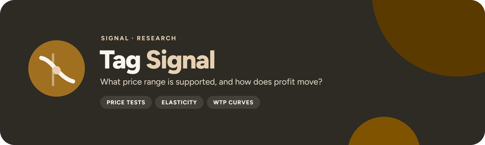

<p align="center">
  
</p>

<p align="center">
  <a href="https://github.com/UlrikErlingsen/pricing-analysis/actions"></a>
  <a href="https://github.com/UlrikErlingsen/signal-hub"></a>
  
  
  <a href="LICENSE"></a>
</p>

<p align="center"><strong>Open pricing evidence — bound the price range, preserve uncertainty, and keep the evidence tier beside the economics.</strong></p>

**Tag Signal** helps analysts, product teams, and marketers compare a declared candidate price with a reference price. It accepts one of three evidence routes—an assigned-price experiment, a historical price–quantity series, or respondent-level willingness to pay—and keeps their interpretations separate. Every route feeds the same transparent economic layer: projected volume multiplied by declared unit margin.

> What price range is supported, and how does profit move?

Everything runs locally with open-source Python packages. There is no account, telemetry, external AI call, remote database, or built-in persistence.

## Read this first

> **Tag Signal bounds a pricing scenario; it does not turn a model into market truth.** Historical coefficients can be confounded, randomized tests support their tested prices and implementation, and WTP is not realized demand. Unit cost, addressable demand, competition, capacity, fairness, and execution still require accountable human judgment.

Tag Signal does not select a price because a p-value crossed a threshold. Before analysis, the contract records a reference price, candidate price, unit cost, planning scale, and a minimum worthwhile incremental contribution that must be above zero — with a zero threshold, the reading would collapse into a bare significance statement, which Tag Signal refuses to present as a decision. The resulting interval is compared with that business threshold.

The highest modeled contribution is a bounded scenario over the evidence range—not an automatic price recommendation. Intervals carry only the modeled sampling uncertainty, not every market risk.

**Working-name status:** a basic screen on 17 July 2026 found no obvious exact active software product called “TagSignal” (written “Tag Signal” since 1.2.0; the screen was not repeated for the spaced form). That is encouraging, but it is not trademark clearance. Keep the label provisional until official registers, company names, domains, package registries, app stores, and relevant jurisdictions have been professionally checked. See [the name screen](docs/name-screen.md).

## Scope

**Version 1.2 supports:**

- a randomized assigned-price test: one row per assigned unit, binary purchase or quantity outcomes, power-curve fit to arm means, stratified within-arm bootstrap;
- a historical price–quantity series: one row per period, numeric controls, log–log demand association with Newey–West HAC or HC3 covariance and smearing retransformation;
- respondent-level willingness to pay: stated or incentive-compatible (BDM or auction) valuations, empirical acceptance curve, respondent bootstrap;
- a declared candidate-versus-reference comparison of volume, margin, and contribution with intervals and a positive minimum worthwhile contribution;
- support audits that flag extrapolation, boundary optima, and weak variation;
- privacy-minimized JSON, XLSX, and CSV-ZIP evidence packs and a compact bridge for Gate Signal.

**It does not:** select a price automatically, turn historical associations into causal elasticities, treat robust covariance as a cure for price endogeneity or omitted demand shocks, treat stated WTP as realized demand, extrapolate silently beyond observed prices, set personalized or dynamic prices, search for exploitable personal prices, or model taxes, fixed costs, capacity, cannibalization, competitor response, channel margins, fairness, legal constraints, or long-run retention unless they are reflected in the inputs. Where a sibling app covers it, use **[Experiment Signal](https://github.com/UlrikErlingsen/experiment-analysis)** for general randomized experiments, **[Choice Signal](https://github.com/UlrikErlingsen/conjoint-analysis)** for attribute utilities, **[Segment Signal](https://github.com/UlrikErlingsen/customer-segmentation)** for stable customer groups, and **[Gate Signal](https://github.com/UlrikErlingsen/launch-decision-gate)** for the wider launch decision.

## Try the demo in three minutes

1. Start the app. It opens with the **fictional randomized price test** already loaded and analysed, so every page shows results without an upload.
2. Review the saved contract on **Evidence contract**: four assigned prices, a reference price, candidate price, unit cost, market opportunities, and a minimum worthwhile contribution.
3. Open **Data & support audit** to see the support table; re-run the pricing analysis there after changing the contract.
4. Inspect arm support, elasticity, the bounded volume and contribution curves, and all warnings on **Demand & economics**.
5. Open **Decision & export** to compare the declared prices and download the privacy-minimized evidence pack as JSON, XLSX, or CSV-ZIP.

All bundled records, products, prices, respondents, and outcomes are fictional and deterministic. They represent no real respondent, organisation, course case or empirical finding. The **Welcome** buttons switch to the fictional historical series or stated-WTP sample, or restore the randomized test; uploading your own table from the sidebar replaces the demo.

## Data contract

CSV, XLSX, and JSON are accepted (a JSON file is an array of row objects or an object with a `data` array; the first Excel worksheet is read). Uploads are limited to 50 MB, 250,000 rows, and 500 columns. Use one observation per analytical unit; prices, quantities, controls, and WTP must be numeric, and prices and WTP strictly positive. Rows incomplete on any declared analytical column are omitted, and more than 25% incomplete rows block analysis.

Randomized price test:

| customer_id | assigned_price | purchased |
|---|---:|---:|
| C0001 | 29.00 | 1 |
| C0002 | 34.00 | 0 |

Historical series:

| period | price | quantity | promotion | distribution |
|---|---:|---:|---:|---:|
| 2025-W01 | 29.40 | 1421 | 1 | 0.73 |
| 2025-W02 | 34.10 | 1128 | 0 | 0.74 |

Valuation sample:

| respondent_id | wtp | segment |
|---|---:|---|
| R0001 | 31.50 | Practical |
| R0002 | 44.00 | Enthusiast |

Fictional demos and starter workbooks for each route are in [`examples/`](examples/), and the app generates the same starter workbook from its sidebar. See the [data guide](docs/data-guide.md) for units, support, missing values, and study-design expectations.

## Analysis contract

The evidence contract is saved before any model is read, and saving it clears old results:

- **Evidence route and data roles:** randomized, historical, or valuation; the price, quantity or outcome, WTP, and control columns.
- **Randomization confirmation** for the assigned-price route, ticked only when price was assigned by a valid random process before the outcome.
- **Elicitation class** for valuations: stated hypothetical WTP or an incentive-compatible BDM or auction.
- **Economic comparison:** declared unit cost, reference price, candidate price, planning multiplier or addressable opportunities, currency label, and the minimum worthwhile incremental contribution (must be above zero).

Writing the candidate, reference, and threshold down first keeps the reading honest: they cannot be revised silently after seeing the curves.

## Methods

### Randomized assigned-price test

Use one row per assigned unit with a positive assigned price and a non-negative purchase or quantity outcome. Tag Signal summarizes each arm, fits a power curve to arm means, and uses a stratified within-arm bootstrap for uncertainty. Binary purchase outcomes are supported.

A causal reading still requires a valid assignment process, assignment before outcome, acceptable outcome observation, faithful price delivery, limited interference, and a population matching the intended decision. The smooth curve between assigned prices is a functional-form assumption.

### Historical price–quantity series

Use one row per period with positive price and quantity plus optional numeric controls. Tag Signal fits a log–log model and reports the price coefficient as a constant-elasticity association. Newey–West HAC or HC3 covariance is available; a smearing factor retransforms log predictions.

Neither robust covariance estimator solves endogenous pricing, omitted promotions, seasonality, competitor action, stock-outs, distribution changes, or simultaneous demand shocks. This route is always labeled **ASSOCIATION ONLY**.

### Respondent-level willingness to pay

Use one row per respondent with a positive maximum WTP. At each price, Tag Signal calculates the empirical share with WTP at or above that price and bootstraps respondents.

Stated WTP is labeled **STATED VALUATION**. An appropriately implemented BDM or auction protocol may be labeled **INCENTIVE-COMPATIBLE VALUATION**, but even that is not a complete market-demand estimate.

### Economic layer

At each supported price, Tag Signal calculates `projected volume × (price − declared unit cost)`, compares the candidate with the reference price draw by draw, and classifies the interval against the declared minimum worthwhile contribution.

See [methods](docs/methods.md).

## Decision statuses

- **MEANINGFUL UPSIDE:** the full interval clears the declared minimum worthwhile contribution.
- **SUPPORTED UPSIDE:** the full interval is positive but does not clear that threshold.
- **UNCERTAIN UPSIDE:** the point estimate is positive but the interval includes no improvement.
- **NO CLEAR ADVANTAGE:** the interval includes both improvement and harm.
- **NO EVIDENCE OF UPSIDE:** the candidate does not improve expected contribution in this model.
- **POTENTIAL HARM:** the full interval is below zero.
- **OUTSIDE EVIDENCE RANGE:** the candidate or reference price requires extrapolation.

These statuses describe one declared comparison under one evidence model. They are not automatic pricing approvals. See the [decision guide](docs/decision-guide.md).

## Exports

JSON, XLSX, and CSV-ZIP exports include:

- source filename, sheet, and SHA-256 fingerprint;
- evidence tier and decision contract;
- support audit, warnings, diagnostics, and method settings;
- aggregate price-arm or WTP summaries;
- coefficient or valuation summaries;
- the bounded price scenario table;
- candidate-versus-reference economics and interval;
- a compact `signal.price-evidence.v1` bridge for a future Gate Signal import.

Uploaded row-level records, identifiers, outcomes, fitted values, residuals, and free text are excluded. Exported text is neutralised against spreadsheet-formula interpretation.

## Run locally

You need Python 3.10 or newer and a local copy of this folder.

**macOS:** double-click `run_app.command`. **Windows:** double-click `run_app.bat`.

Or use a terminal:

```bash
python3 -m venv .venv
source .venv/bin/activate  # Windows: .venv\Scripts\activate
python -m pip install -r requirements.txt
python -m streamlit run app.py
```

The macOS launcher prefers local port `8588` and falls back to a free port between 8501 and 8599; it accepts the `TAGSIGNAL_PORT`, `TAGSIGNAL_MAX_UPLOAD_MB`, and `TAGSIGNAL_NO_BROWSER` environment variables. The Windows launcher always uses port `8588`. Setting `TAGSIGNAL_DEBUG=1` shows technical error details inside the app on any platform.

### Docker

```bash
docker build -t tagsignal .
docker run --rm -p 8588:8588 tagsignal
```

Then open http://127.0.0.1:8588. The container runs as a non-root user and includes a health check.

## Privacy

Data entered in the browser is processed by the local Streamlit process and remains there unless you download or otherwise move it; aggregate price response, valuation, and source fingerprints in an export can still be confidential. If someone hosts Tag Signal, that operator becomes responsible for transport security, authentication, logs, retention, and applicable privacy obligations. See [PRIVACY.md](PRIVACY.md).

## No install? Give this file to an AI

[AI_ANALYST.md](AI_ANALYST.md) is a standalone analysis protocol for a capable AI assistant. It carries the same evidence-tier separation, calculations, warnings, and output structure. The local app is the more private option: a cloud AI sees whatever you upload or paste.

## Development

```bash
python -m pip install -e ".[test]"
python -m pytest
python -m ruff check .
python -m build
```

The analysis core (`tagsignal`) installs without Streamlit or Plotly; the app needs the `ui` extra (`python -m pip install -e ".[ui]"`), and `requirements.txt` lists everything for the launchers and Docker. [Signal Hub](https://github.com/UlrikErlingsen/signal-hub) embeds the app through `tagsignal.ui.render()`.

Fixtures cover known elasticity recovery, randomized arm behavior, empirical WTP demand, decision boundaries, deterministic examples, safe imports and exports, the shared Signal shell, every Streamlit page, and the Signal Hub contract (no Streamlit or Plotly import outside `ui/`, `render()` without a page config, namespaced keys, no repository-root file reads).

## Where this fits in Signal

Tag Signal sits in the Research family. It shares the suite’s local-first, named-method, fictional-demo, portable-evidence, and explicit-boundary standard.

- **[Worth Signal](https://github.com/UlrikErlingsen/customer-value-analytics)** supplies customer and contribution economics that can improve pricing scenarios.
- **[Segment Signal](https://github.com/UlrikErlingsen/customer-segmentation)** can reveal stable groups for separately designed pricing studies; Tag Signal does not search for exploitable personal prices.
- **[Choice Signal](https://github.com/UlrikErlingsen/conjoint-analysis)** estimates attribute utilities. WTP conversion remains outside its first release; Tag Signal accepts direct valuation or price-response evidence instead of silently converting weak price coefficients.
- **[Experiment Signal](https://github.com/UlrikErlingsen/experiment-analysis)** is the general randomized-experiment engine. Tag Signal adds pricing-specific demand and contribution logic while retaining strict randomization caveats.
- **[Alloc Signal](https://github.com/UlrikErlingsen/marketing-mix-allocation)** allocates marketing budgets, not product prices.
- **[Gate Signal](https://github.com/UlrikErlingsen/launch-decision-gate)** can consume the aggregate Tag Signal bridge as one bounded launch input.
- **[Trace Signal](https://github.com/UlrikErlingsen/journey-path-analysis)** — descriptive customer-journey evidence from event logs: transitions, path support, drop-off, and Markov removal sensitivity, with no causal channel credit.
- **[Track Signal](https://github.com/UlrikErlingsen/brand-tracking)** — brand-tracking wave comparison: separate measures with intervals, multiple-comparison control, and declared practical thresholds.

<!-- signal-suite:start (generated from signal-hub/apps.yaml by scripts/sync_readme_suite.py) -->
| Family | App | Asks |
|---|---|---|
| Brand | [Track Signal](https://github.com/UlrikErlingsen/brand-tracking) | Is the brand moving, or is the tracker just noisy? |
| Brand | [Position Signal](https://github.com/UlrikErlingsen/brand-positioning) | Where do brands sit relative to competitors? |
| Market | [Prospect Signal](https://github.com/UlrikErlingsen/b2b-prospecting) | Which Norwegian companies fit your ideal customer, and which first? |
| Market | [Listen Signal](https://github.com/UlrikErlingsen/media-listening) | Who is talking about the brand in Norwegian media, and in what tone? |
| Market | [Influence Signal](https://github.com/UlrikErlingsen/influencer-campaigns) | Which creators delivered, and was every post labelled properly? |
| Market | [Season Signal](https://github.com/UlrikErlingsen/marketing-calendar) | What does the Norwegian marketing year look like, worked backwards? |
| Market | [Adopt Signal](https://github.com/UlrikErlingsen/adoption-forecasting) | When will a new product be adopted? |
| Customer | [Worth Signal](https://github.com/UlrikErlingsen/customer-value-analytics) | What are customers and relationships worth? |
| Customer | [Segment Signal](https://github.com/UlrikErlingsen/customer-segmentation) | Do customers form stable, useful groups? |
| Customer | [Trace Signal](https://github.com/UlrikErlingsen/journey-path-analysis) | How do logged customer journeys actually unfold? |
| Customer | [Recommend Signal](https://github.com/UlrikErlingsen/recommender-evaluation) | Which recommendation policy should be tested live? |
| Research | [Choice Signal](https://github.com/UlrikErlingsen/conjoint-analysis) | How do product attributes drive choice? |
| Research | [Driver Signal](https://github.com/UlrikErlingsen/survey-driver-analysis) | Which measured experiences move with satisfaction? |
| Research | [Measure Signal](https://github.com/UlrikErlingsen/measurement-validation) | Does a multi-item score have a defensible structure? |
| Research | [Text Signal](https://github.com/UlrikErlingsen/open-text-analysis) | What recurring patterns appear in open-ended responses? |
| Research | **Tag Signal** (this app) | What price range is supported, and how does profit move? |
| Decide | [Experiment Signal](https://github.com/UlrikErlingsen/experiment-analysis) | Did the treatment cause a practically meaningful change? |
| Decide | [Gate Signal](https://github.com/UlrikErlingsen/launch-decision-gate) | Does a concept deserve the next investment? |
| Decide | [Alloc Signal](https://github.com/UlrikErlingsen/marketing-mix-allocation) | Where should the next marketing budget go? |

All 19 apps run side by side in [Signal Hub](https://github.com/UlrikErlingsen/signal-hub), each opening with fictional demo data. Every repo carries the [`signal-suite`](https://github.com/topics/signal-suite) topic, and the suite is listed at [ulrikerlingsen.com](https://ulrikerlingsen.com). Freddo CRM is a separate product.
<!-- signal-suite:end -->

## References

- Becker, G. M., DeGroot, M. H., & Marschak, J. (1964). Measuring utility by a single-response sequential method. *Behavioral Science, 9*, 226–232. https://doi.org/10.1002/bs.3830090304
- Vickrey, W. (1961). Counterspeculation, auctions, and competitive sealed tenders. *Journal of Finance, 16*, 8–37.
- Newey, W. K., & West, K. D. (1987). A simple, positive semi-definite, heteroskedasticity and autocorrelation consistent covariance matrix. *Econometrica, 55*, 703–708. https://doi.org/10.2307/1913610
- MacKinnon, J. G., & White, H. (1985). Some heteroskedasticity-consistent covariance matrix estimators with improved finite sample properties. *Journal of Econometrics, 29*, 305–325. https://doi.org/10.1016/0304-4076(85)90158-7
- Efron, B. (1979). Bootstrap methods: Another look at the jackknife. *Annals of Statistics, 7*, 1–26. https://doi.org/10.1214/aos/1176344552
- Duan, N. (1983). Smearing estimate: A nonparametric retransformation method. *Journal of the American Statistical Association, 78*, 605–610. https://doi.org/10.1080/01621459.1983.10478017
- Schmidt, J., & Bijmolt, T. H. A. (2020). Accurately measuring willingness to pay for consumer goods. *Journal of the Academy of Marketing Science, 48*, 499–518. https://doi.org/10.1007/s11747-019-00666-6

## Originality and license

Tag Signal is an independent implementation based on public pricing, experimental, econometric, and valuation literature. It does not reproduce lecture slides, classroom cases, assessment material, teaching diagrams, proprietary pricing templates, or institution-specific wording. All bundled examples and interface copy were created for this project. See [sources and originality](docs/sources-and-originality.md).

The software and documentation are free under **AGPL-3.0-or-later**. See [LICENSE](LICENSE). The license covers this project’s expression, not ownership of the published statistical methods it implements.

This application was developed with AI coding assistance and checked through source review, analytical fixtures, deterministic synthetic recovery, automated app tests, and visual inspection. Verify material pricing decisions independently; no warranty is provided.

---

<p>
  
  <strong>Tag Signal</strong> is part of <a href="https://github.com/UlrikErlingsen/signal-hub"><strong>Signal</strong></a>, open marketing-evidence tools by <a href="https://ulrikerlingsen.com">Ulrik Erlingsen</a>.
</p>
